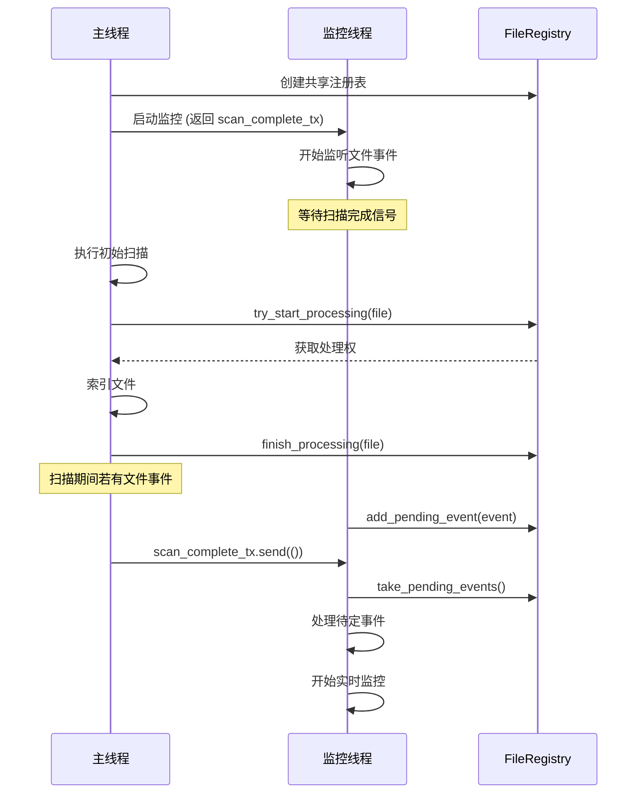

# 智能文档搜索引擎 (AI-Enhanced Document Search)

基于 Rust 开发的高性能本地文档搜索引擎。集成了 **Tantivy** 倒排索引与 **BERT** 深度学习模型，实现了从"传统关键词搜索"到"AI 语义理解"的跨越。支持实时文件监控、增量索引、自动语义打标签及自然语言查询。

## ✨ 主要特性

* **🧠 AI 语义驱动**:
  * **自动打标签 (Auto-Tagging)**: 使用 KeyBERT 算法分析文档语义，自动生成核心关键词标签。
  * **意图识别 (Query Refinement)**: 理解用户自然语言查询（如"找一下关于...的文档"），自动提取核心检索词。
  * **Embedding 缓存**: 基于 sled 数据库缓存关键词提取结果，避免重复计算。

* **🚀 高性能架构**:
  * **先监听后扫描**: 原子性协调机制，确保初始化期间的文件变更不会丢失。
  * **FileRegistry 协调**: 扫描与监听线程通过注册表原子同步，防止重复处理。
  * **多线程模型**: 后台监听线程 + 前台交互线程分离。
  * **内存映射 (Mmap)**: 基于 Tantivy 的 MmapDirectory，实现极速读写。

* **⚡️ 增量索引**:
  * **智能检测**: 基于文件时间戳 (Timestamp) 和内容哈希记录。
  * **极速启动**: 重启时只处理新增或修改过的文件，跳过未变动文件。
  * **孤儿清理**: 启动时自动清理已删除文件的残留索引。

* **📂 全面支持**:
  * **多格式**: `.txt`, `.md`, `.pdf` (自动提取文本)。
  * **中文优化**: 集成 Jieba 分词，精准切分中文词汇。

* **🔄 自动化**:
  * **实时监听**: 文件创建、修改、删除即刻同步索引。
  * **事件去重**: 智能过滤 macOS FSEvents 产生的重复事件。
  * **持久化**: 数据永久保存至磁盘，ACID 事务保证。


## 系统要求

* Linux / macOS / RISC-V
* Rust 工具链
* 网络连接（首次运行需下载约 200MB 的量化 BERT 模型）

## 安装和使用

### 1. 编译项目

```bash
cargo build --release
# 或交叉编译到 RISC-V
cargo zigbuild --release --target riscv64gc-unknown-linux-gnu
```

### 2. 准备目录

程序启动时会自动创建，手动创建也可以：

```bash
mkdir -p docs storage cache
```

### 3. 启动全栈服务

```bash
cargo run
```

如果网络不好可以本地下载 BAAI/bge-small-zh-v1.5 拷贝到 model 目录：
```bash
huggingface-cli download BAAI/bge-small-zh-v1.5 --local-dir ./model
```

服务启动后将显示 AI 模型加载及增量扫描状态：

```text
 [AI] 正在加载 BERT 模型 (首次运行需下载)...
 [AI] 模型加载完毕！
 [Cache] 缓存统计: 5 条记录, 524287 字节
--- 文件搜索系统 ---
 [后台] 正在监控: "./docs"
 [前台] 输入关键词进行搜索 (输入 'quit' 退出)
 [监控] 文件监控已启动
 [后台] 正在扫描现有文件...
正在解析文件: "./docs/paper.pdf"
   [Cache] 命中缓存: ["神经网络", "深度学习", "算法"]
[Done] [后台] 新文件已索引: paper (输入搜索词继续)
 [后台] 初始索引完成，共处理 1 个文件
 [同步] 扫描完成，监控已激活
 [监控] 扫描完成，开始处理实时事件
>
```

### 4. 实时智能搜索

支持直接输入自然语言，AI 会自动优化查询：

```bash
> 帮我找一下关于机器学习的资料
 🧠 [AI] 意图识别: '帮我找一下关于机器学习的资料' -> '机器学习'
 [文档标题] 机器学习导论.pdf
    路径: docs/机器学习导论.pdf
    标签: 监督学习 无监督学习 算法

> quit
```

### 5. 后台自动索引

保持程序运行，在另一个终端添加文档：

```bash
cp new_research.pdf docs/
```

主程序会自动响应：

```text
正在解析文件: "./docs/new_research.pdf"
   [Cache] 未命中，计算关键词...
   [AI] 生成标签: ["Transformer", "NLP", "Attention"]
[Done] [后台] 新文件已索引: new_research (输入搜索词继续)
```

删除文件同样会自动清理索引：

```bash
rm docs/old_file.txt
```

```text
 [监控] 文件已删除，清理索引: old_file
 [Cache] 已清理缓存: /path/to/old_file.txt
```

## 🔍 核心架构

### 先监听后扫描 (Watch-First Architecture)



### 多线程与 AI 协作

```mermaid
graph TD
    User[用户输入] --> MainThread[主线程]
    FileSys[文件系统] --> WatcherThread[后台线程]
    
    subgraph MainThread
        Input[接收查询] --> Refine[AI 意图识别]
        Refine --> Search[Tantivy 搜索]
        Search --> Result[显示结果]
    end
    
    subgraph WatcherThread
        Event[监听变化] --> Filter[事件过滤]
        Filter --> Extract[文本提取]
        Extract --> Cache{缓存检查}
        Cache -->|命中| UseCache[使用缓存标签]
        Cache -->|未命中| Embed[BERT 语义分析]
        Embed --> SaveCache[保存到缓存]
        SaveCache --> Index[写入索引]
        UseCache --> Index
        Index --> Commit[持久化存储]
    end
    
    MainThread <-->|共享 Index (MVCC)| WatcherThread
```

## � 并发同步问题处理

本项目在多线程环境下面临多个并发挑战，以下是各问题的解决方案：

### 1. 初始化竞态条件

**问题**: 传统"先扫描后监听"模式下，扫描期间新增的文件会被遗漏。

**解决方案**: 采用"先监听后扫描"架构
```
1. 启动监控线程 → 立即开始监听事件
2. 监控线程等待扫描完成信号
3. 主线程执行扫描 → 扫描期间事件进入 pending 队列
4. 扫描完成 → 发送信号 → 监控处理 pending 事件
5. 进入正常实时监控模式
```

### 2. 扫描与监听重复处理

**问题**: 同一文件可能同时被扫描线程和监听线程处理，导致重复索引。

**解决方案**: `FileRegistry` 原子锁
```rust
// 原子获取处理权，失败则跳过
if !registry.try_start_processing(&path, EventType::Create) {
    return; // 其他线程正在处理
}
// 处理完成后释放
registry.finish_processing(&path, FileState::Indexed);
```

### 3. macOS FSEvents 多重事件

**问题**: macOS 对单次文件修改会触发多个事件 (Metadata, Data, Any 等)。

**解决方案**: 事件类型过滤
```rust
match event.kind {
    EventKind::Create(_) => { /* 处理 */ }
    EventKind::Modify(ModifyKind::Data(_)) => { /* 仅处理数据变更 */ }
    EventKind::Remove(_) => { /* 处理 */ }
    _ => { /* 忽略其他事件 */ }
}
```

### 4. 删除事件误报

**问题**: macOS 有时将删除事件报告为 Modify 事件。

**解决方案**: 文件存在性检查
```rust
EventKind::Modify(_) => {
    if !path.exists() {
        // 实际是删除，执行删除逻辑
        delete_from_index(...);
    } else {
        // 真正的修改
        process_and_index(...);
    }
}
```

### 5. 搜索结果不一致

**问题**: 索引更新后，搜索结果仍显示旧数据。

**解决方案**: Tantivy `ReloadPolicy::OnCommitWithDelay`
```rust
let reader = index
    .reader_builder()
    .reload_policy(ReloadPolicy::OnCommitWithDelay)
    .try_into()?;
```
IndexReader 在 commit 后自动刷新，搜索始终获取最新数据。

### 6. 缓存一致性

**问题**: 文件内容变更后，缓存的关键词可能过期。

**解决方案**: 内容哈希校验
```rust
// 缓存 key = 文件路径, value = (content_hash, keywords)
let current_hash = calculate_hash(&content);
if let Some((cached_hash, keywords)) = cache.get(&path) {
    if cached_hash == current_hash {
        return keywords; // 内容未变，使用缓存
    }
}
// 内容变更，重新计算
```

### 7. 孤儿索引清理

**问题**: 程序未运行时删除的文件，其索引残留在数据库中。

**解决方案**: 启动时孤儿扫描
```rust
fn cleanup_orphan_indexes() {
    for doc in index.all_documents() {
        let path = doc.get("path");
        if !Path::new(path).exists() {
            delete_from_index(path);
            cache.remove(path);
        }
    }
}
```

### 并发模型总结

| 组件 | 同步机制 | 作用 |
|------|----------|------|
| `FileRegistry` | `Arc<Mutex<HashMap>>` | 文件处理权原子分配 |
| `scan_complete_tx` | `mpsc::channel` | 扫描完成信号通知 |
| `pending_events` | `Mutex<Vec>` | 暂存扫描期间事件 |
| `Index` | Tantivy MVCC | 读写分离，无锁读取 |
| `EmbeddingCache` | sled (内置锁) | 线程安全 KV 存储 |

## 📁 目录结构

```text
.
├── docs/          # [监控] 放入文档即可自动索引
├── storage/       # [数据] Tantivy 索引数据库
├── cache/         # [缓存] sled Embedding 缓存
├── model/         # [模型] BERT 模型文件 (离线模式)
├── src/
│   ├── main.rs    # 主程序 (初始化与交互)
│   ├── lib.rs     # 库入口 (模块导出)
│   ├── ai.rs      # AI 模块 (BERT 模型封装)
│   ├── indexer.rs # 索引逻辑 (扫描、监听、写入)
│   ├── search.rs  # 搜索逻辑 (查询解析)
│   ├── extract.rs # 提取逻辑 (PDF/文本解析)
│   ├── cache.rs   # 缓存模块 (Embedding 缓存)
│   ├── registry.rs# 注册表 (扫描/监听协调)
│   ├── models.rs  # 数据结构
│   └── config.rs  # 配置常量
└── Cargo.toml     # 依赖配置
```

## 🏗️ 技术栈

| 领域 | 技术 | 用途 |
|------|------|------|
| **NLP / AI** | `candle` (BERT) | 语义关键词提取 |
| **搜索引擎** | `tantivy` + `tantivy-jieba` | 倒排索引 + 中文分词 |
| **文件监控** | `notify` | FSEvents (macOS) / inotify (Linux) |
| **文档解析** | `pdf-extract` | PDF 文本提取 |
| **缓存存储** | `sled` + `bincode` | 嵌入式 KV 数据库 |
| **并发模型** | `std::thread` + `mpsc` | 多线程协调 |

## ⚙️ 工作流程详情

1. **启动阶段**
   * 加载 BERT 模型（支持离线模式）。
   * 初始化 Tantivy 索引（Schema: `title`, `body`, `path`, `tags`, `timestamp`）。
   * 加载 Embedding 缓存。
   * 创建 FileRegistry 协调器。
   * **先启动监控线程**，然后执行增量扫描。

2. **扫描阶段**
   * 遍历 `docs/` 目录。
   * 通过 Registry 原子获取文件处理权。
   * 检查时间戳，跳过未变更文件。
   * 清理孤儿索引（文件已删除但索引残留）。

3. **处理阶段 (后台)**
   * **事件过滤**: 只处理 `Create`, `Modify(Data)`, `Remove` 事件。
   * **提取**: 解析 PDF/文本内容。
   * **缓存检查**: 命中则直接使用，未命中则 BERT 计算。
   * **索引**: 存入文档内容、路径、标签及时间戳。
   * **删除处理**: 文件删除时清理索引和缓存。

4. **查询阶段 (前台)**
   * **意图识别**: AI 分析查询语句，提取核心意图。
   * **检索**: 在 `title`, `body`, `tags` 字段中进行联合搜索。
   * **实时刷新**: IndexReader 自动刷新，确保搜到最新内容。

## 故障排除

| 问题 | 解决方案 |
|------|----------|
| 服务启动慢 | 首次运行需下载模型，或将模型放入 `./model` 离线加载 |
| 文件未索引 | 检查文件格式是否支持 (.txt/.md/.pdf)，查看控制台日志 |
| 搜索不到新文件 | Tantivy 有短暂延迟，等待几秒后重试 |
| Schema 错误 | 删除 `storage/` 和 `cache/` 目录后重启 |
| macOS 重复事件 | 已自动过滤，如仍有问题请提 Issue |

## 🤝 贡献

欢迎提交 Issue 和 Pull Request 改进 AI 模型效果或支持更多格式！

## 📜 License

MIT
